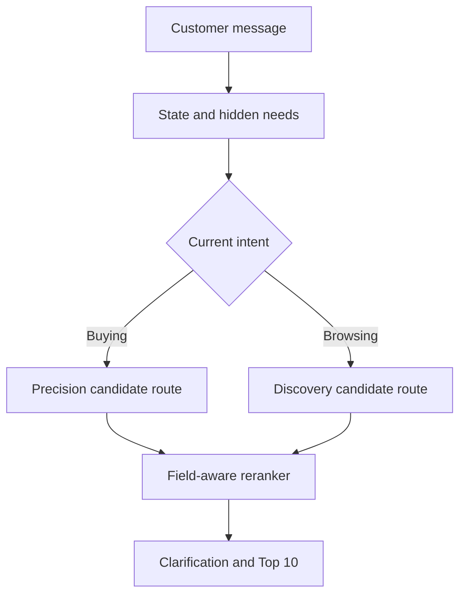

# Need Decoder architecture

## Design goals

The agent has to do three things at once: respect hard constraints, make useful guesses when the
shopper is vague, and finish within ten turns. The implementation keeps those responsibilities
separate so a mistake in one layer is visible and recoverable.

## Request path

### Conversation state

`ConversationState` stores the current category, explicit constraints, excluded terms, numeric budget,
hypotheses, attributes already asked about, and the routed intent. It does not store raw purchase
history. The supplied profile is kept at session scope and is not injected as arbitrary search text.

Intent override is handled as a slot update rather than a full reset. The opening preference is
removed, while requirements collected through direct clarification remain. The question history is
reset because a newly stated goal can make an earlier question relevant again.

### Hidden needs

Every inferred need has four fields:

- attribute being inferred;
- normalized value used for retrieval;
- confidence between zero and one;
- short evidence label suitable for a demo or audit log.

Inferred terms receive 28% of the equivalent explicit-term contribution before their confidence is
applied. This makes them useful tie-breakers rather than hard filters.

### Retrieval and ranking

SQLite FTS5 provides the first-stage index. Buying and Browsing use different evidence ordering and
candidate limits. Both retain a category-only safety route so a narrow interpretation cannot remove
the target before reranking. Three query forms contribute to the pool:

1. category plus conversational evidence;
2. category alone, which protects recall;
3. evidence alone, which handles incomplete category text.

The reranker scores unique term coverage by field. Titles and product features receive equal weight
for explicit evidence, followed by categories, details, brand/store, and description. Rare terms
receive more weight through IDF. Exact normalized constraints receive a separate bonus. Numeric
budgets are scored against the catalog price, while explicit exclusions receive a penalty. A
log-scaled review-count prior helps break otherwise unresolved matches without becoming a hard rule.

### Clarification policy

The policy asks about feature, material, color, style, size, use case, budget, brand, and finally an
open detail. The order reflects the released intent-card distribution, but the state machine can ask
for more information about an already observed attribute. This is important when a customer provides
one material requirement but the catalog still contains a large set of plausible matches.

The anonymized profile's preference tags can move a related question earlier after the three
highest-yield attributes. They do not enter retrieval as free-form keywords, which avoids silently
turning a historical preference into a current-session requirement.

## Failure behavior

- Empty or generic input returns a valid response and continues clarification.
- Negative answers do not become search terms.
- Explicit exclusions and care instructions such as `no leather` and `no ironing` are distinguished.
- Non-numeric or unavailable prices do not stop retrieval.
- A correction removes stale preference text.
- FTS query failures fall through to the remaining retrieval routes.
- No network or model failure can block the offline agent.

## Evaluation boundary

`starter/agent.py` returns exactly the fields in the official contract. Explainability information is
available through `inspect_session()` for the demo but is not included in scorer responses. Public
ground-truth labels are used only by the organizer evaluator and the separate diagnostic script.
